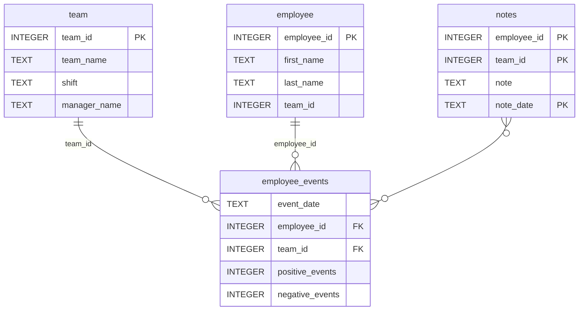

# Software Engineering for Data Scientists 

This repository contains starter code for the **Software Engineering for Data Scientists** final project. Please reference your course materials for documentation on this repository's structure and important files. Happy coding!

### Repository Structure
```
├── README.md
├── assets
│   ├── model.pkl
│   └── report.css
├── env
├── python-package
│   ├── employee_events
│   │   ├── __init__.py
│   │   ├── employee.py
│   │   ├── employee_events.db
│   │   ├── query_base.py
│   │   ├── sql_execution.py
│   │   └── team.py
│   ├── requirements.txt
│   ├── setup.py
├── report
│   ├── base_components
│   │   ├── __init__.py
│   │   ├── base_component.py
│   │   ├── data_table.py
│   │   ├── dropdown.py
│   │   ├── matplotlib_viz.py
│   │   └── radio.py
│   ├── combined_components
│   │   ├── __init__.py
│   │   ├── combined_component.py
│   │   └── form_group.py
│   ├── dashboard.py
│   └── utils.py
├── requirements.txt
├── start
├── tests
    └── test_employee_events.py
```

### employee_events.db



### Setup

```bash
# 1. Create and activate a virtual environment (Python 3.10+)
python -m venv .venv
.venv\Scripts\Activate.ps1        # Windows PowerShell
# source .venv/bin/activate       # macOS / Linux

# 2. Build the employee_events package distribution
cd python-package
python setup.py sdist
cd ..

# 3. Install all dependencies, including the employee_events package
pip install -r requirements.txt
```

### Run the tests

```bash
pytest
```

### Run the dashboard

```bash
cd report
python dashboard.py
```

Then open http://localhost:5001 in a browser. Use the radio buttons and
dropdown to switch between individual employees and teams. The dashboard
shows cumulative positive/negative performance events, the model-predicted
recruitment risk (colored green → red by severity), and manager notes.
